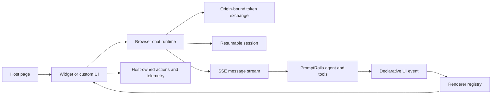
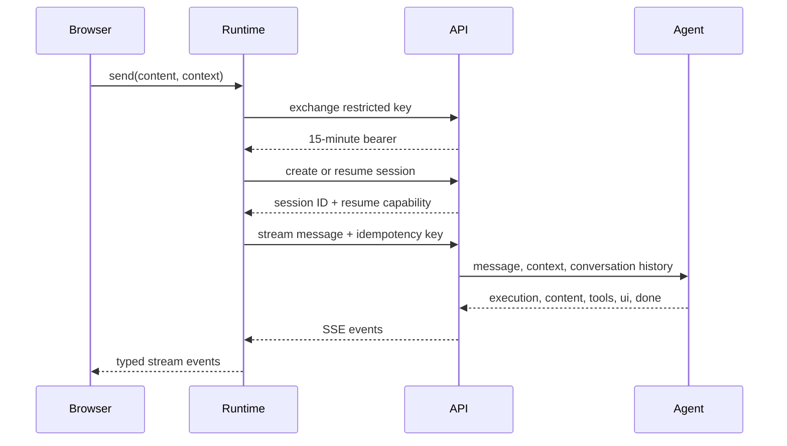

# Architecture

`@promptrails/ai-chat` separates transport, conversation state, rendering, and host-side effects. Generic chat, React applications, and ecommerce storefronts can therefore share one browser security contract without sharing a visual design.



## Security boundary

The browser receives only a publishable key restricted to `chat:write`, explicit agent IDs, exact origins, `browser_only=true`, and an anonymous-traffic rate limit. It exchanges that key for a 15-minute bearer kept only in memory. A random resume capability authorizes one persisted session and is bound server-side to the key and exact origin.

Provider credentials, user JWTs, PromptRails management keys, tool secrets, and unrestricted API keys are never browser configuration.

## Message boundary

Customer text and page context are different values:

```json
{
  "content": "Is size S available?",
  "client_context": {
    "path": "/products/linen-dress",
    "product_id": "linen-dress"
  },
  "idempotency_key": "client-generated-message-id"
}
```

`content` is stored and rendered as the user message. `client_context` is an untrusted object exposed to the agent as the separate `context` input. The UI never needs to hide or parse a prompt envelope.

## Session lifecycle



The bearer refreshes before expiration. The local session expires after 24 hours by default and can never exceed 30 days. `BroadcastChannel` coordinates the active capability between same-origin tabs. Starting a new session clears local state immediately and revokes the prior session on a best-effort basis.

## UI protocol

Model output is treated as data. `normalizeChatUI()` accepts versioned resources, suggestions, and declarative actions. It does not execute HTML, JavaScript, or model-provided URLs. Host applications register renderers and action handlers for known `kind` values; unknown kinds remain inert.

The ecommerce preset resolves product identity against the host catalog before displaying trusted price, image, variant, and slug fields. Cart and navigation effects are emitted back to the host page as composed DOM events.
