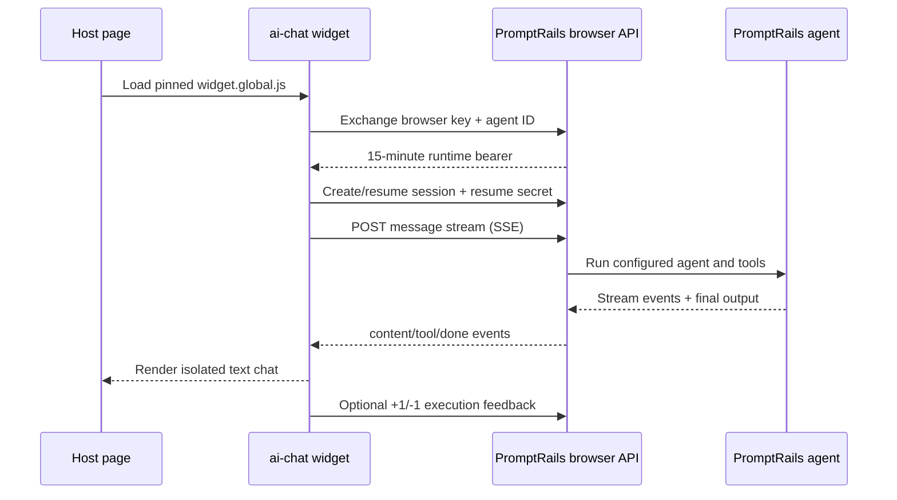

# Generic browser widget

`dist/widget.global.js` is the general-purpose text chat widget. It is isolated
from the host page by Shadow DOM and uses PromptRails' public browser chat
runtime. It does not use the private Agent UI service or a storefront BFF.

## Install

Pin a release in production:

```html
<script
  src="https://cdn.jsdelivr.net/npm/@promptrails/ai-chat@0.9.1/dist/widget.global.js"
  data-provider="promptrails"
  data-base-url="https://api.promptrails.ai"
  data-api-key="BROWSER_ONLY_CHAT_KEY"
  data-agent-id="AGENT_KSUID"
  data-workspace-id="WORKSPACE_KSUID"
  data-title="Destek Asistanı"
  data-placeholder="Size nasıl yardımcı olabilirim?"
  data-greeting="Merhaba! Sorunuzu birlikte çözelim."
  data-primary-color="#111111"
  data-persist-session="true"
  data-session-max-age="86400"
  data-new-session-label="Yeni sohbet"
  data-feedback-label="Bu yanıt yardımcı oldu mu?"
></script>
```

The same options can be passed to `PromptRailsChat.init()`. `stylesheetUrl`
(or `data-stylesheet-url`) loads an HTTPS or same-site stylesheet inside the
ShadowRoot after the built-in CSS. Common variables include:

```css
:host {
  --prc-primary-color: #111111;
  --prc-primary-hover: #333333;
  --prc-bg-color: #ffffff;
  --prc-text-color: #111827;
  --prc-text-secondary: #6b7280;
  --prc-border-color: #e5e7eb;
  --prc-font-family: Inter, sans-serif;
  --prc-panel-width: 380px;
  --prc-panel-height: 600px;
  --prc-z-index: 2147483000;
}
```

## Browser key policy

The embedded API key is public by definition. Create a PromptRails browser-only
key with:

- exactly `chat:write`,
- an explicit agent allowlist,
- exact production origins (HTTPS; localhost HTTP only for development),
- `browser_only=true`,
- a rate limit appropriate for anonymous traffic.

The public key does not need a general read permission for persisted chat.
Message history is authorized by the short-lived browser token together with
the resume capability for that one session.

The browser key is sent only to `POST /api/v1/browser/chat/token`. The resulting
short-lived bearer remains in memory, is refreshed before expiry, and is never
written to browser storage. Chat operations require both that bearer and the
random `X-Chat-Resume-Token`, which is bound server-side to the key and origin.

With persistence enabled, localStorage contains only the session ID, resume
secret, and last activity timestamp. On reload the widget asks the API to verify
the capability before rendering server-stored history. Local inactivity expires
after 24 hours by default and is capped at 30 days. The new-session button clears
local state immediately and revokes the previous session on a best-effort basis.

## Runtime flow



## Structured context and imperative API

Visible customer text is never mixed with page metadata. Supply structured context independently:

```js
PromptRailsChat.init({
  provider: { type: "promptrails", apiKey, agentId },
  contextProvider: () => ({ path: location.pathname }),
  onEvent: (event) => analytics.track(event.type, event.detail),
});

PromptRailsChat.updateContext({ productId: "dress-1" });
await PromptRailsChat.send("Is size S available?");
await PromptRailsChat.newSession();
```

The PromptRails agent receives `message` and an optional `context` input. Treat every context value as untrusted user-controlled data.

Built-in labels follow `locale`; override individual values with `labels`. Stable Shadow DOM parts include `launcher`, `panel`, `header`, `messages`, and `composer`.

## CSP and CORS

Allow the pinned CDN in `script-src` (or self-host the release asset), the
PromptRails API in `connect-src`, and any custom stylesheet origin in
`style-src`. PromptRails must list the page's exact origin on the browser key;
do not use wildcard origins for credentialed production widgets.

For nonce-based policies set `styleNonce` or `data-style-nonce`. The nonce is copied to the widget's built-in Shadow DOM style element.
